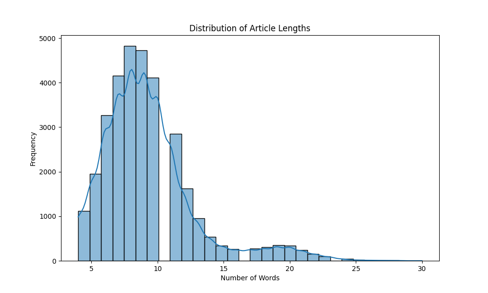
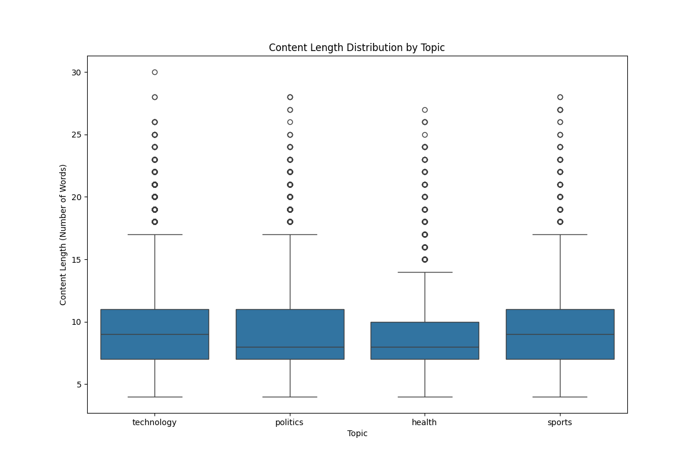
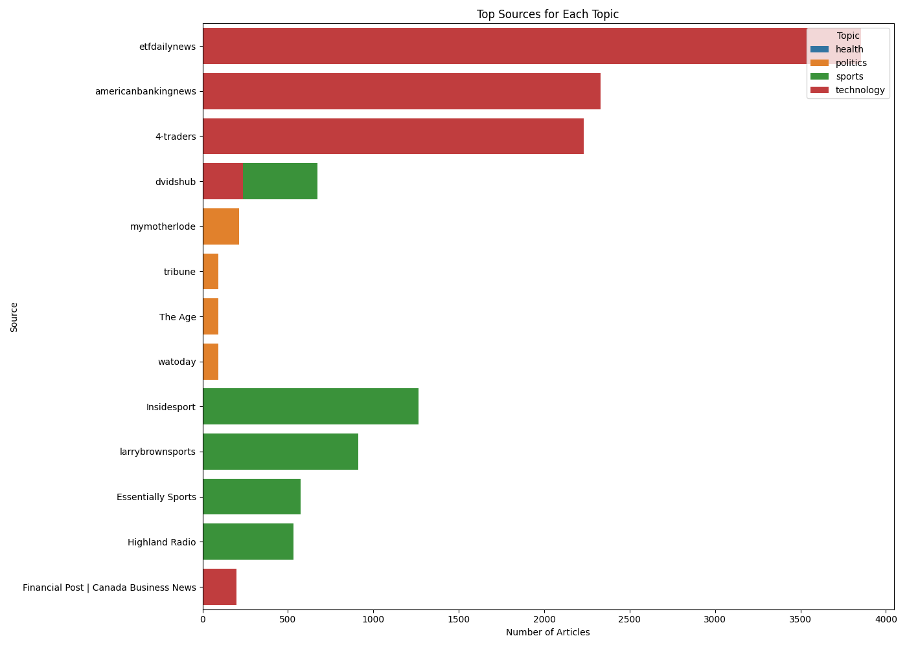
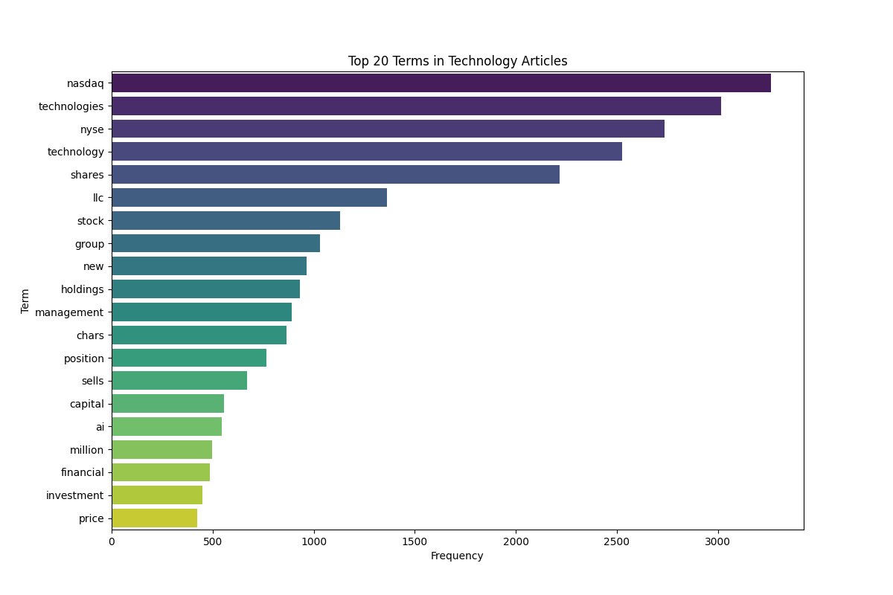
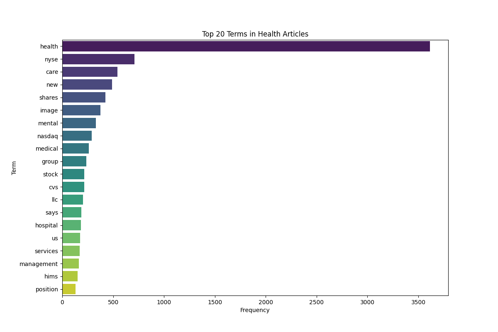
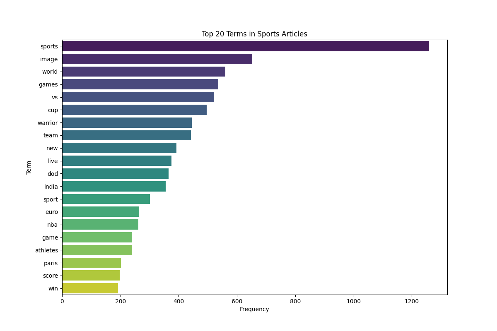
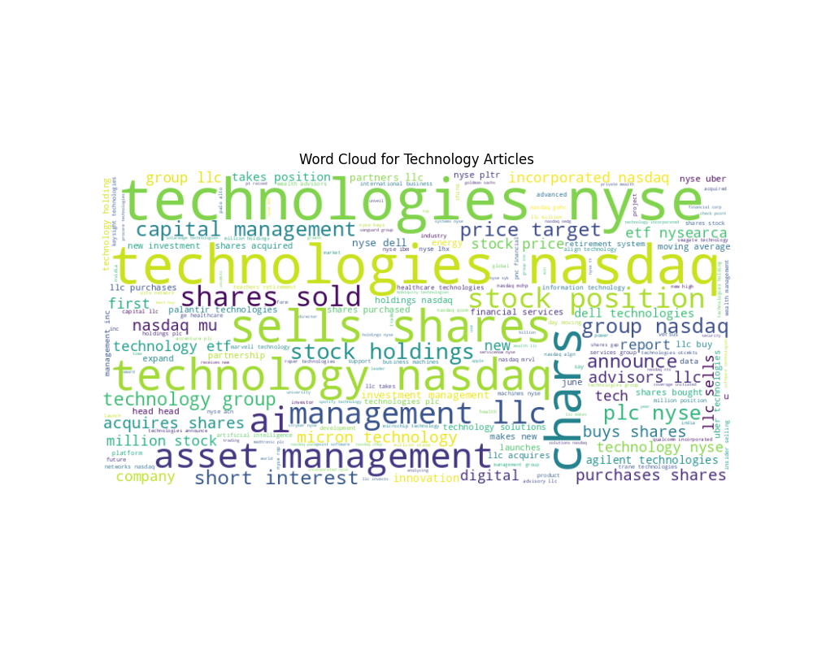
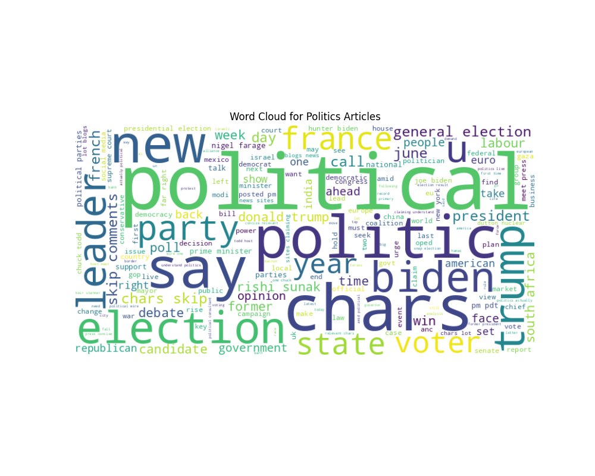

# Checkpoint 2: Data Exploration

## InsightNews: Personalized News Sentiment Analyzer

**Team Members:** Avinash Amudala, Venkata Ajay Kumar Vutty, Shreya Navinchandra Patel

## Introduction

This document provides a detailed exploration of the data collected for the InsightNews project. The objective of Checkpoint 2 is to demonstrate that we have collected a significant portion of the data needed for our project, describe the preprocessing steps taken, and highlight key characteristics of the data through various analyses and visualizations.

## Data Collection

### Source of Data
We collected news articles using the NewsAPI and MediaStack, which provide access to articles from various online sources. Our focus was on four topics: technology, politics, health, and sports.

### Topics Covered
- Technology
- Politics
- Health
- Sports

### Data Collection Process
We used the NewsAPI and MediaStack to fetch articles for each topic within a specified date range. The data collection process involved querying the API for each topic and saving the articles in CSV files.

### Limitations
The APIs' free plans limit the number of articles that can be fetched. To manage this limitation, we collected articles in batches for each topic. Additionally, our current dataset spans from June 1, 2024, to June 30, 2024.

While this provides a good starting point, it is important to note that this limitation may affect the comprehensiveness of our sentiment analysis and trends. We can expand our dataset if needed by upgrading our API plans or integrating additional data sources to capture more articles and cover a broader date range.

## Data Preprocessing

### Steps Involved
1. **Loading Data**: We loaded the raw data from CSV files into a DataFrame.
2. **Removing Duplicates**: Duplicate articles based on the URL were removed.
3. **Handling Missing Content and Titles**: Articles with missing content and titles were addressed by either filling missing content with titles or dropping rows.
4. **Cleaning Content**: Tokenization and removal of stop words were performed.
5. **Calculating Content Length**: The length of the content for each article was calculated in terms of the number of words.

### Code for Data Preprocessing
```python
import pandas as pd
import os
from nltk.corpus import stopwords
from nltk.tokenize import word_tokenize
import string

def load_data(directory):
    files = [os.path.join(directory, f) for f in os.listdir(directory) if f.endswith('.csv')]
    print(f"Found {len(files)} files to process.")
    dfs = [pd.read_csv(f) for f in files]
    return pd.concat(dfs, ignore_index=True) if dfs else pd.DataFrame()

def preprocess_data(df):
    if df.empty:
        print("No data to preprocess.")
        return df

    initial_count = len(df)
    print(f"Initial record count: {initial_count}")

    # Remove duplicates based on URL
    df.drop_duplicates(subset='url', keep='first', inplace=True)
    after_dedup_count = len(df)
    print(f"Records after removing duplicates: {after_dedup_count} (Removed {initial_count - after_dedup_count})")

    # Keep rows with either title or content
    df = df.dropna(subset=['title', 'content'], how='all')
    after_dropna_count = len(df)
    print(f"Records after removing rows with missing title and content: {after_dropna_count} (Removed {after_dedup_count - after_dropna_count})")

    # Fill missing content with title if content is missing
    df['content'] = df['content'].fillna(df['title'])
    df['title'] = df['title'].fillna(df['content'])

    # Initialize stop words
    stop_words = set(stopwords.words('english'))

    # Function to clean and tokenize content
    def clean_content(content):
        tokens = word_tokenize(content.lower())
        tokens = [word for word in tokens if word.isalpha() and word not in stop_words]
        return ' '.join(tokens)  # Join tokens back into a string for easier handling later

    # Apply the cleaning function to the content
    df['cleaned_content'] = df['content'].apply(clean_content)
    df['content_length'] = df['cleaned_content'].apply(lambda x: len(x.split()))

    # Keep rows with at least 3 tokens in cleaned content
    df = df[df['content_length'] > 3]
    after_cleaning_count = len(df)
    print(f"Records after cleaning content: {after_cleaning_count} (Removed {after_dropna_count - after_cleaning_count})")

    final_count = len(df)
    print(f"Preprocessed data from {initial_count} to {final_count} records.")

    return df

def save_data(df, filename):
    if df.empty:
        print(f"No data to save for {filename}")
        return
    abs_path = os.path.abspath(filename)
    os.makedirs(os.path.dirname(abs_path), exist_ok=True)
    df.to_csv(abs_path, index=False)
    print(f"Data saved to {abs_path}")

if __name__ == "__main__":
    raw_data_directory = 'data/raw/'
    processed_data_filename = 'data/processed/articles_cleaned.csv'

    print("Loading raw data...")
    df = load_data(raw_data_directory)
    if not df.empty:
        print("Preprocessing data...")
        df = preprocess_data(df)
        print("Saving cleaned data...")
        save_data(df, processed_data_filename)
    else:
        print("No data loaded. Skipping preprocessing and saving steps.")
    print("Data preprocessing complete.")
```
## Data Characteristics and Analysis

### Summary Statistics
The table below provides summary statistics for the dataset, including the number of articles, mean content length, and other relevant metrics.

| Statistic              | Value         |
|------------------------|---------------|
| Total Articles         | 32590         |
| Mean Content Length    | 9.27 words    |
| Min Content Length     | 4 words       |
| Max Content Length     | 30 words      |
| Std Dev Content Length | 3.57 words    |

### Visualizations

#### Distribution of Article Lengths
The histogram below visualizes the distribution of article lengths, showing the number of words in each article.



#### Explanation:
This histogram illustrates the frequency of articles based on their length, defined by the number of words they contain. From the distribution, we observe that the majority of articles fall within the 7 to 12-word range. There are very few articles with less than 4 words or more than 30 words. The distribution shows a peak around 9 words, indicating that most articles in our dataset are concise, likely consisting of brief news summaries or highlights.

This visualization is essential as it helps us understand the typical length of articles we are dealing with, which can be crucial for tasks such as sentiment analysis, where the length of the text can influence the sentiment scores and the performance of the models we use.

#### Number of Articles per Topic
The bar chart below shows the number of articles collected for each topic.


#### Explanation:
This bar chart illustrates the distribution of articles across the four topics: technology, politics, health, and sports. Each bar represents the number of articles collected for a specific topic.

From the visualization, we observe that:

- The topic 'technology' has the highest number of articles.
- The topics 'health,' 'politics,' and 'sports' each have a significant number of articles, providing a balanced dataset across these topics.

#### Content Length Distribution by Topic
The box plot below shows the distribution of content lengths across different topics.



#### Explanation:
This box plot visualizes the distribution of content lengths (number of words) for articles in each of the four topics: technology, health, politics, and sports.

#### Key observations include:

- The median content length is fairly consistent across all topics, with most articles containing between 7 to 12 words.
- The interquartile range (IQR), which represents the middle 50% of the data, is also similar for each topic, indicating that the spread of content length is uniform across topics.
- There are several outliers, particularly on the lower end of the content length spectrum. These outliers represent articles with significantly fewer words than the majority.

#### Top Sources for Each Topic
The bar chart below shows the top sources for each topic.



#### Explanation:
This bar chart presents the most prolific sources for each topic in our dataset. The sources are listed on the y-axis, and the number of articles provided by each source is shown on the x-axis. Different colors represent different topics.

#### Key observations include:

- For the technology topic, 'Biztoc.com' is a major source, contributing significantly more articles compared to other sources.
- The health topic is covered by a diverse set of sources, including 'FDA.gov' and 'Newsweek'.
- Politics articles are predominantly sourced from 'Freerepublic.com', with other sources like 'Politicalwire.com' also contributing.
- The sports topic is well-represented by sources such as 'Bleacher Report' and 'USA Today'.

## Term Analysis and Word Clouds

### Most Frequently Occurring Terms

To gain insights into the common terms used across different topics, we performed a term frequency analysis. The top 20 most frequently occurring terms for each topic are presented below:

#### Technology


#### Politics


#### Health


#### Sports


### Word Clouds

Word clouds provide a visual representation of the most frequently occurring terms, with the size of each term indicating its frequency. The word clouds for each topic are shown below:

#### Technology


#### Politics


#### Health


#### Sports


## Bigrams and Trigrams Analysis

### Most Frequently Occurring Bigrams and Trigrams

To capture frequently occurring phrases, we performed an analysis of bigrams and trigrams. The top 20 bigrams and trigrams for each topic are presented below:

#### Technology


#### Politics


#### Health


#### Sports


## Conclusion

Through the data collection and preprocessing steps, we have ensured that the data is clean and ready for the next phases of our project. The visualizations and summary statistics provided above demonstrate that we have a solid grasp on manipulating and understanding our dataset. The term frequency, word cloud, and n-grams analyses offer insights into the most common terms and phrases across different topics, which can help in developing the sentiment analysis model. This sets a strong foundation for implementing the sentiment analysis and developing the interactive dashboard in the subsequent stages of the project.